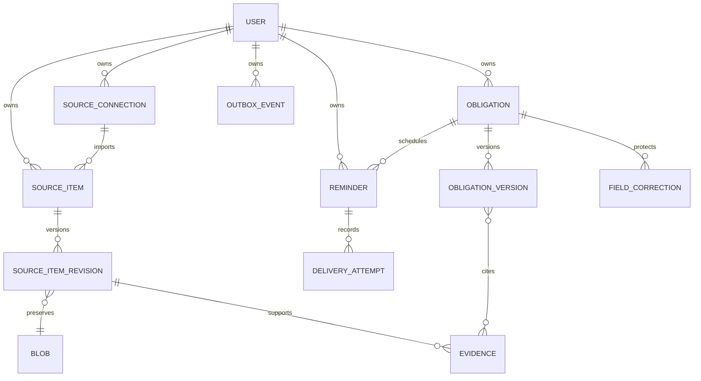

# ERD inicial v1

El diagrama define pertenencia, inmutabilidad y puntos de persistencia para V02 y V03. No es una migración ni autoriza crear entidades diferidas.

Reglas reservadas: todas las tablas de dominio llevan `user_id`; una restricción única garantiza una sola versión actual de obligación; `source_item` es único por `(user_id, source_connection_id, external_id)` para separar dos cuentas Gmail del mismo usuario; evidencia y versiones no se actualizan; outbox se inserta en la misma transacción que su cambio de dominio. Los nombres y columnas finales los decide V02 sin romper estas garantías.
